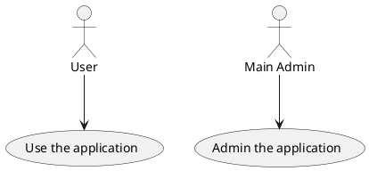
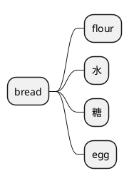

这是用例图

```plantuml
@startuml
:User: --> (Use)
"Main Admin" as Admin
"Use the application" as (Use)
Admin --> (Admin the application)
@enduml
```
下面是一个思维导图

```plantuml
@startmindmap
* bread
** flour
** 水
** 糖
** egg
@endmindmap
```

一个简单的泳道图
```plantuml
Cat -> Dog : hello
Dog -> Cat : hi
```